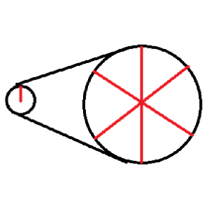
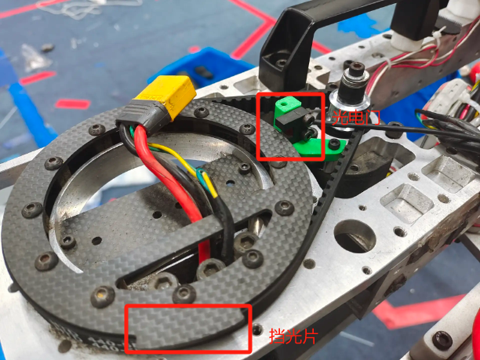
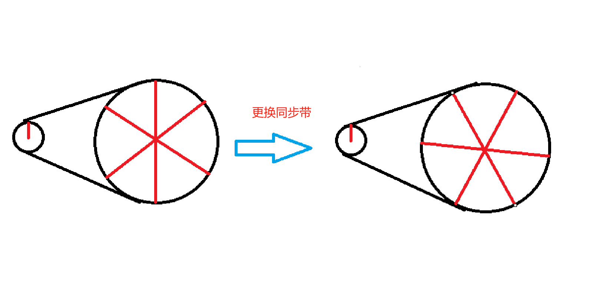
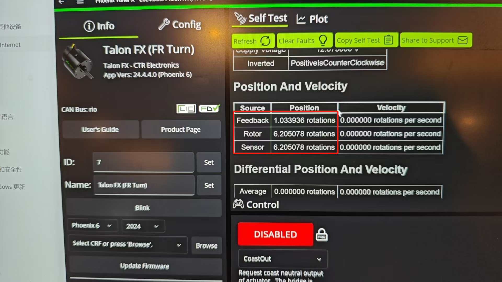

## 底盘复位原理
你应该已经注意到了这样一个过程————在上电或deploy程序之后的第一次enable时，底盘的四个轮子会立刻开始比较缓慢的绕z轴旋转，在一段时间后迅速地转向斜45度，四个轮子的朝向构成X形。你也许会觉得奇怪，程序如何得知刚上电时的轮子朝向从而计算出电机需要再转多少圈轮子才会朝向斜45度？

实际上，每次刚刚上电或重新部署代码之后，程序并不知道轮子朝向哪里。必须通过前述“缓慢的绕z轴旋转”的操作得轮子的朝向。获取轮子朝向依赖两个东西————电机的绝对编码器和光电门。

### 电机的绝对编码器
绝对编码器是一种依赖磁场（或光电）测量电机轴的位置的传感器。它会反馈电机轴当前的绝对位置（而不是相对于上电时的初始位置旋转了多少圈）。

然而由于电机转6圈，轮子才会绕z轴旋转一圈的原因，当电机轴处在同一个位置时，轮子有六种可能的朝向。这时候就需要光电门在这6个位置判断出当前的真正位置。

### 光电门
在轮子模块的上表面，有一个凸起的挡光片，在它经过光电门时光电门可以感应到。因为挡光片对的圆心角小于60度，所以只要光电门感应到东西，就可以确定轮子朝向在哪个六分之一扇面中。结合电机绝对编码器的数据，就可以知道轮子的准确朝向。

## 更换同步带之后底盘复位修正
同步带断了之后，更换同步带时电机轴和模块几乎肯定会发生相对转动。因此更换同步带前后，同一个电机编码器的绝对位置对应的轮子的六个可能朝向都会同步地发生正负30度以内的的偏差。

为了修正这个改变，需要使用Tuner X重新读取轮子朝前时的的电机绝对编码器输出值。
### 具体操作
1. 将轮子朝向全部朝前（请用一条足够长的板子搭在前后两个轮子的边上以确保轮子向前的非常精确）
2. 连上机器并打开tuner X
3. 选择同步带断的转向电机并读取当前的Sensor值（有小概率是Feedback值，请用其它三个没断同步带的转向电机的Sensor值和Feedback值和Constants里写的AzimuthEncoderOffsetRotation做比较来确定）

4. 把新的值写到Constants的 模块名.azimuthEncoderOffsetRotation里（请用电机id和tunerX的blink功能确定模块）
5. 上电 deploy代码 enable，确认四个模块在复位之后都是非常精确的斜45度，请注意偏个一两度也是不可接受的。如果不符合，重复2-5
